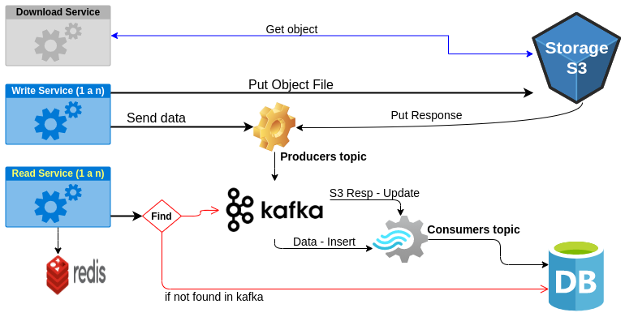
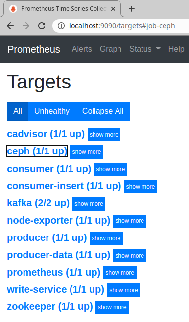

# service-kafka-s3-db-poc

Development of **Docker** containers to create a suitable environment emulating the execution of **Kafka/S3/DB/Services** and monitoring with **Grafana/Prometheus**.

Architecture Docker Images

* Kafka - [confluentinc/cp-kafka:6.0.0](https://hub.docker.com/r/confluentinc/cp-kafka)
* Zookeeper - [confluentinc/cp-zookeeper:6.0.0](https://hub.docker.com/r/confluentinc/cp-zookeeper)
* S3 - [ceph/daemon](https://hub.docker.com/r/ceph/daemon)
* DB - [mysql:5.7.25](https://hub.docker.com/_/mysql)

Monitor Docker Images

* Grafana - [grafana/grafana](https://hub.docker.com/r/grafana/grafana)
* Prometheus - [prom/prometheus](https://hub.docker.com/r/prom/prometheus)
* Alertmanager - [prom/alertmanager](https://hub.docker.com/r/prom/alertmanager)
* Node Exporter - [prom/node-exporter](https://hub.docker.com/r/prom/node-exporter)
* Cadvisor - [gcr.io/cadvisor/cadvisor:v0.36.0](https://github.com/google/cadvisor)

Services Applications

* Service [publisher-http-s3](https://github.com/janusky/publisher-http-s3)
* Producer [http-source-kafka](https://repo.spring.io/snapshot/org/springframework/cloud/stream/app/http-source-kafka/3.0.0-SNAPSHOT/http-source-kafka-3.0.0-SNAPSHOT.jar)
* Consumer [jdbc-sink-kafka](https://repo.spring.io/snapshot/org/springframework/cloud/stream/app/jdbc-sink-kafka/3.0.0-SNAPSHOT/jdbc-sink-kafka-3.0.0-SNAPSHOT.jar)

>Info: Producer & Consumer ([+](https://spring.io/blog/2020/08/10/case-study-build-and-run-a-streaming-application-using-an-http-source-and-a-jdbc-sink))

## Objetive

It seeks to reflect the scenario where they interact

**user** -> **webapp** (send file and metadata)

1. Save file in S3

2. Publish message on Kafka

Desired indicators

* Numbers of files processed
* Total size of processed file: XXXMb
* Kafka instances 
* HTTP/Connections/Errors Servicios

Proposed architecture



## Run

The default execution requires a computer at least 8GB of RAM. If you have a lower computer, you must run in [development mode](DEVELOPMENT.md#Run-develop-mode).

A mode [easy](#run-for-dummies) and [step by step](#run-step-by-step) are available. Developers are advised to proceed with the execution step by step, to gain a better understanding.

* [Run for dummies](#run-for-dummies)
* [Run step by step](#run-step-by-step)

>**INFO**  
>If you need to update docker
>* [See upgrade docker](docs/docker.md)
>
>If you want to delete the containers and volumes run `docker-compose down -v`.

### Run for dummies

There is a file [run-for-dummies.sh](run-for-dummies.sh) type `script` that allows executing the application in a single action

```sh
# Download project
git clone https://github.com/janusky/service-kafka-s3-db-poc.git

# Run
bash run-for-dummies.sh
```

Enter in [Accesses](#accesses) or see [Demo](#demo).

### Run step by step

Step-by-step execution, detailing the components/artifacts involved

* **1** [Download project](#download-project)
* **2** [Copy involved apps](#copy-involved-apps)
* **3** [Start run](#start-run)

#### Download project

The project is necessary to configure the containers involved

```sh
git clone https://github.com/janusky/service-kafka-s3-db-poc.git
```

#### Copy involved apps

Producer & Consumer ([+](https://spring.io/blog/2020/08/10/case-study-build-and-run-a-streaming-application-using-an-http-source-and-a-jdbc-sink))

```sh
cd service-kafka-s3-db-poc

wget -O producers/send_app/http-source-kafka-3.0.0-SNAPSHOT.jar https://repo.spring.io/snapshot/org/springframework/cloud/stream/app/http-source-kafka/3.0.0-SNAPSHOT/http-source-kafka-3.0.0-SNAPSHOT.jar

wget -O consumers/insert_app/jdbc-sink-kafka-3.0.0-SNAPSHOT.jar wget https://repo.spring.io/snapshot/org/springframework/cloud/stream/app/jdbc-sink-kafka/3.0.0-SNAPSHOT/jdbc-sink-kafka-3.0.0-SNAPSHOT.jar
```

Service [publisher-http-s3](https://github.com/janusky/publisher-http-s3)

* <https://github.com/janusky/publisher-http-s3/packages/528509>

```sh
cd service-kafka-s3-db-poc

# Download from web: publisher-http-s3-0.0.1-20201204.132644-1.jar
curl $(curl -f -L https://github.com/janusky/publisher-http-s3/packages/528509?version=0.0.1-SNAPSHOT | grep -Eo 'href="(.*publisher-http-s3-0.*\.jar.*)"' | cut -d'"' -f2 | sed 's/\&amp;/\&/g') -o services/write_app/publisher-http-s3-0.0.1-SNAPSHOT.jar
```

#### Start run

Run when you have downloaded the [applications involved](#copy-involved-apps)

```sh
cd service-kafka-s3-db-poc

# Run docker-compose
docker-compose up -d
```

After run Ceph configuration remember [Check s3 Prometheus](#check-S3-Prometheus)

```sh
# Verify State Up
docker-compose ps

# Run Ceph config
# If sudo grep "Bucket" $(docker inspect --format={{.LogPath}} ceph)
[[ -n "$(docker logs ceph 2>&1 | grep "/opt/ceph-container/bin/entrypoint.sh: SUCCESS")" ]] && bash ./s3/ceph/ceph-prometheus.sh || echo -e "\e[31mWait for Ceph to finish"
```

Enter in [Accesses](#accesses) or see [Demo](#demo).

#### Check S3 Prometheus

S3 services

```sh
docker exec ceph ceph mgr services
`{
    "prometheus": "http://ceph:9283/",
    "restful": "https://ceph:8003/"
}`
```

S3 metrics -> http://localhost:9283/metrics

## Accesses

After executing you should access the following URLs

* Grafana -> http://localhost:3000/ (admin/admin)

* Prometheus -> http://localhost:9090/
  * Check Jobs Up http://localhost:9090/targets

* Ceph -> http://localhost:9280/ or http://172.240.49.25:9280/

* Alermanager -> http://localhost:9093/

## Demo

[Kafka](https://kafka.apache.org/) and [Zookeeper](https://zookeeper.apache.org/) run more than one instance. Also S3 ([Ceph](https://ceph.io/)), Data Base ([Mysql](https://www.mysql.com/)), and [Grafana](https://grafana.com/) with [Prometheus](https://prometheus.io/).

> IMPORTANT: See the status of `Apps/Kafka` with` Grafana` by accessing http://localhost:3000 (admin/admin).
>
> It is recommended [send data](#Send-data) before accessing to see the `dashbord`.

Input application [publisher-http-s3](https://github.com/janusky/publisher-http-s3.git)

* POST -> S3
* POST -> Producer (Kafka)

Producer and Consumer at Kafka

* Producer [http-source-kafka](producers/send_app/http-source-kafka-3.0.0-SNAPSHOT.jar) -> in topic
* Consumer [jdbc-sink-kafka](consumers/insert_app/jdbc-sink-kafka-3.0.0-SNAPSHOT.jar) -> out topic & write database

First step [Run](#run)

Before start, check all container run

```sh
# Verify State Up
docker-compose ps

# Bucket is created
sudo grep "Bucket" $(docker inspect --format={{.LogPath}} ceph) | jq .
or
docker exec ceph s3cmd ls
`2020-11-16 18:09  s3://sandbox-bk`

# Other checks
docker logs producer-data | grep -e 'Started HttpSourceKafkaApplication'
docker logs consumer-insert | grep -e 'partitions assigned'
docker logs write-service | grep -e 'Started Application in'
```

**Prometheus Jobs** -> (http://localhost:9090/targets)



### Send data

```sh
cd service-kafka-s3-db-poc

# Post to write_app
curl -v --noproxy '*' -F transaction=001 \
  -F files=@./services/write_app/files/file-one.pdf \
  http://localhost:9000/api/v1/post
```

>NOTE: If you want to send a JSON that represents the object consumed by the `Producer`.
>
>```sh
># Directly to the Producer (test)
>curl --noproxy '*' http://localhost:9001 -H 'Content-Type:application/json' -d '
>{
>  "transaction":"002",
>  "id_customer":"0123456789",
>  "attach":{"filename":"file2","url":"s3://uri_s3_file_2","size":"1mb","mimetype":"zip"}
>}'
>```

### Check DB

```sh
# pass -> rootpw
docker exec -it database mysql -u root -p

mysql>Use Demo;
mysql>select * from Post;
mysql>exit;
```

### Check S3

```sh
# Bucket is created
docker exec ceph s3cmd ls
`2020-11-16 18:09  s3://sandbox-bk`

# List object in bucket
docker exec ceph s3cmd ls s3://sandbox-bk
`DIR  s3://sandbox-bk/post/`

# Get object in bucket
docker exec ceph s3cmd get s3://sandbox-bk/post/20201119/f185d09d-ec44-41aa-bbec-bdbc1d71c248 f185d09d-ec44-41aa-bbec-bdbc1d71c248
`download: 's3://sandbox-bk/post/20201119/f185d09d-ec44-41aa-bbec-bdbc1d71c248' -> 'f185d09d-ec44-41aa-bbec-bdbc1d71c248'  [1 of 1]
 4371255 of 4371255   100% in    0s    12.85 MB/s  done`

# Copy file
docker cp ceph:/f185d09d-ec44-41aa-bbec-bdbc1d71c248 ./file-one.pdf
```

### Grafana dashboard

Grafana -> http://localhost:3000/ (default: admin/admin)

## TODO

* Complete architecture propose

  * Implement `producer-s3` and `consumer-update` 
  * Develop services `Download` and `Read`
